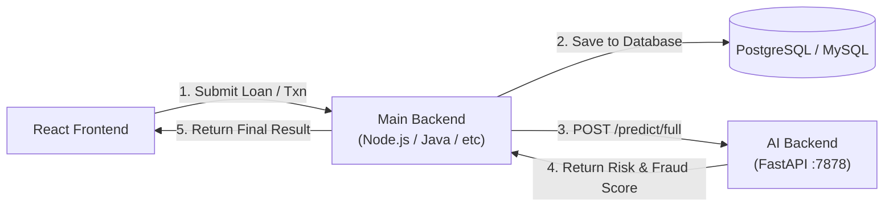

# Integrating the AI Microservice with Your Main Backend

This guide explains how to connect your new **Algorisk AI Backend** (running on FastAPI at `http://localhost:7878`) with your main application backend (e.g., Node.js, Spring Boot, or Django) that serves your React frontend.

## 🏗️ Architecture (Microservices Pattern)

You now have a **Microservices Architecture**. Instead of putting heavy Machine Learning code into your main backend, they talk to each other over HTTP.



## 🛠️ How to Implement (Node.js / Express Example)

If your main backend is built with Node.js and Express, you will use `axios` or `fetch` to send data to the AI API.

Create a new file in your main backend called `aiService.js`:

```javascript
// aiService.js
const axios = require('axios');

const AI_API_URL = process.env.AI_API_URL || 'http://localhost:7878';

/**
 * Sends a transaction to the AI Fraud Engine.
 */
async function checkTransactionFraud(transactionData) {
    try {
        const response = await axios.post(`${AI_API_URL}/predict/fraud`, transactionData, {
            timeout: 5000 // 5 second timeout so AI doesn't hang your server
        });
        return response.data; 
        /* Returns: { fraud_score: 75, risk_level: "HIGH", reasons: [...], action: "BLOCK" } */
    } catch (error) {
        console.error("AI Fraud Service Error:", error.message);
        // Fallback: If AI is down, default to "ALLOW" but flag for manual review later
        return { fraud_score: 0, risk_level: "UNKNOWN", action: "ALLOW_WITH_WARNING" };
    }
}

/**
 * Sends a client's profile and loan request to the Credit Risk Engine.
 */
async function assessCreditRisk(clientData, loanData) {
    try {
        const payload = {
            client: clientData,
            loan: loanData
        };
        const response = await axios.post(`${AI_API_URL}/predict/credit_risk`, payload, {
            timeout: 5000
        });
        return response.data;
        /* Returns: { pd: 0.83, expected_loss: 490000, decision: { status: "REJECTED" } } */
    } catch (error) {
        console.error("AI Credit Risk Service Error:", error.message);
        throw new Error("Could not reach the AI risk assessment service.");
    }
}

module.exports = {
    checkTransactionFraud,
    assessCreditRisk
};
```

## 🚀 How to Use It in Your Main Controllers

Now, in your main backend routes (e.g., when a user makes a transaction), you call the service:

```javascript
// transactionController.js
const { checkTransactionFraud } = require('./aiService');
const TransactionModel = require('../models/Transaction'); // Your DB model

exports.processTransaction = async (req, res) => {
    const { clientId, amount, type, country } = req.body;

    // 1. Prepare data for AI
    const txnForAI = {
        client_id: clientId,
        amount: amount,
        transaction_hour: new Date().getHours(),
        transaction_type: type,
        country: country,
        channel: "mobile_app"
    };

    // 2. Call the AI Backend
    const aiResult = await checkTransactionFraud(txnForAI);

    // 3. Make a business decision based on AI
    if (aiResult.action === "BLOCK_TRANSACTION" || aiResult.risk_level === "HIGH") {
        // Save blocked attempt to DB
        await TransactionModel.create({ clientId, amount, status: "BLOCKED", reason: aiResult.reasons[0] });
        return res.status(403).json({ 
            success: false, 
            message: "Transaction blocked due to suspicious activity.",
            details: aiResult.reasons
        });
    }

    // 4. If safe, process transaction in your database normally
    const newTxn = await TransactionModel.create({ clientId, amount, status: "COMPLETED" });
    
    return res.status(200).json({
        success: true,
        message: "Transaction successful",
        fraudCheck: aiResult.risk_level
    });
};
```

## 🔑 Key Best Practices Included Here:

> [!TIP]
> **Use Timeouts**
> Always set a timeout (e.g., `timeout: 5000`) when calling the AI API. If the Python server crashes or is restarting, your main backend won't freeze waiting for a response.

> [!IMPORTANT]
> **Graceful Degradation**
> In the `catch (error)` block for the Fraud engine, I implemented a "Fallback". If the AI server is down, you probably don't want to block *all* user transactions. You allow them through but maybe log a warning to check them manually later.

> [!NOTE]
> **Security**
> Right now, the AI API has no authentication. It's safe if it runs on `localhost` or an internal VPC network where the outside world can't reach port `8000`. If you deploy the AI API publicly, we will need to add an API Key verification to `app.py`.
